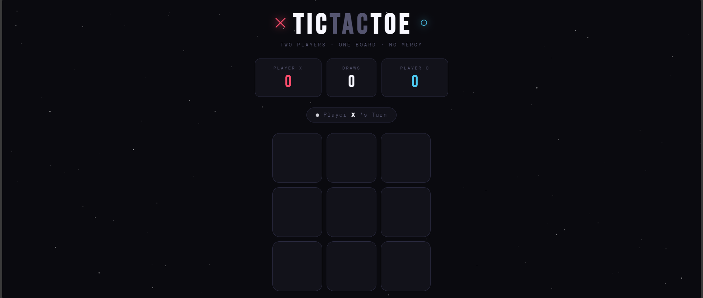
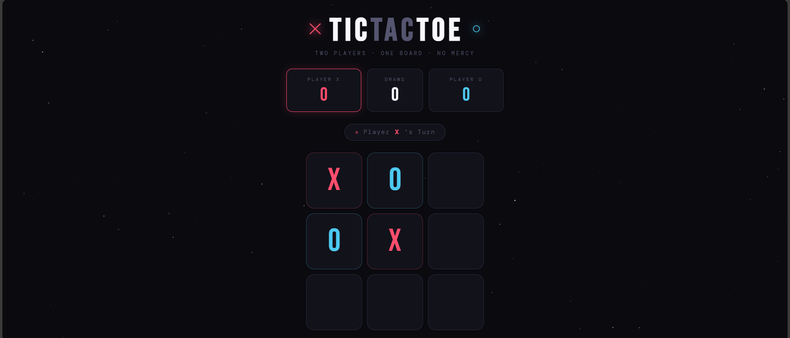
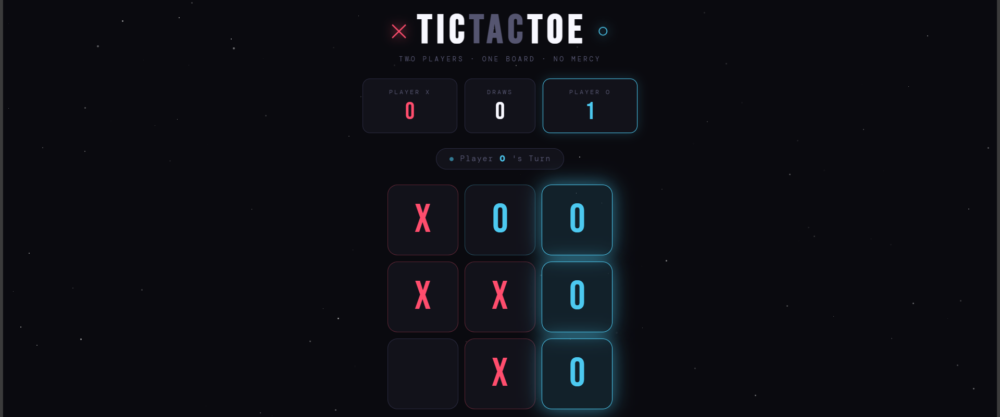
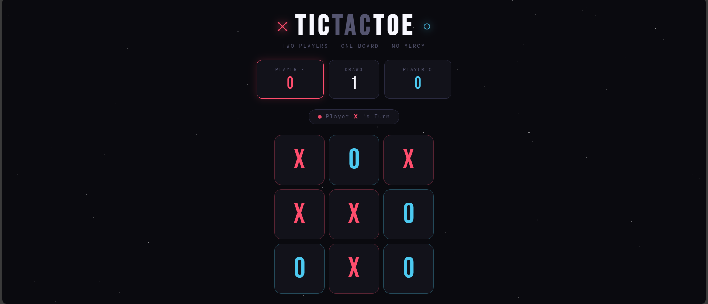

# ✕ Tic-Tac-Toe ○
## live project: https://tic-toe-game-git-main-rodriguendzanas-projects.vercel.app/
A sleek, modern Tic-Tac-Toe game built with pure HTML, CSS, and JavaScript — no frameworks, no dependencies.



---

## 📖 Description

This is a two-player Tic-Tac-Toe game featuring:

- 🎮 **Two-player local gameplay** — take turns on the same device
- 📊 **Live scoreboard** — tracks wins for X, O, and draws across rounds
- 🎉 **Win animations** — confetti burst and cell highlighting on victory
- 🌌 **Cosmic dark UI** — animated starfield background with glowing accents
- 📱 **Fully responsive** — works on desktop, tablet, and mobile

---

## 🚀 How to Run

### Option 1 — Open directly in your browser
1. Download or clone this repository
2. Double-click `index.html` to open it in your browser

```bash
git clone https://github.com/RodrigueNdzana/tic-toe-game.git
cd tic-tac-toe
open index.html       # macOS
start index.html      # Windows
xdg-open index.html   # Linux
```

### Option 2 — Use a local server (recommended)
If you have VS Code, install the **Live Server** extension, right-click `index.html`, and choose **Open with Live Server**.

Or with Python:
```bash
# Python 3
python -m http.server 8080
# Then visit http://localhost:8080
```

---

## 📁 Project Structure

```
tic-tac-toe/
├── index.html      # Game markup & structure
├── style /
    └──main.css       # Styling, animations, layout
├── javascript
   └──main.js       # Game logic (moves, win detection, scoring)
├── README.md       # You are here
└── screenshots/    # Project screenshots
    └── gameplay.png
```

---

## 🛠 Prerequisites

- Any modern web browser (Chrome, Firefox, Safari, Edge)
- No installation or build tools required
- Internet connection only needed to load Google Fonts (optional — game still works offline with fallback fonts)

---

## 🎮 How to Play

1. The game starts with **Player X**
2. Players take turns clicking any empty cell
3. First player to get **3 in a row** (horizontally, vertically, or diagonally) wins
4. If all 9 cells are filled with no winner, it's a **Draw**
5. Click **Play Again** to start a new round (scores are kept)
6. Click **Reset Scores** to wipe everything and start fresh

---

## 🧩 Features Breakdown

| Feature | Details |
|---|---|
| Win Detection | Checks all 8 winning combinations after each move |
| Score Tracking | Persistent within session; resets on "Reset Scores" |
| Animations | CSS keyframe pop-in, confetti burst, win cell glow |
| Responsive Design | Fluid layout using CSS Grid and clamp() |
| No Dependencies | Pure vanilla HTML/CSS/JS — zero npm, zero bundlers |

---

## 📸 Screenshots

> Screenshots taken during local development — timestamp visible in browser/taskbar.

| State | Screenshot |
|---|---|
| Game in progress |  |
| Player 0 wins |  |
| Draw result |  |

---

## 👨‍💻 Author

Built as part of a Software Engineering version control assignment.  
Demonstrates: Git workflow, project structure, documentation, and clean frontend code.

---

## 📄 License

MIT — free to use, modify, and distribute.
